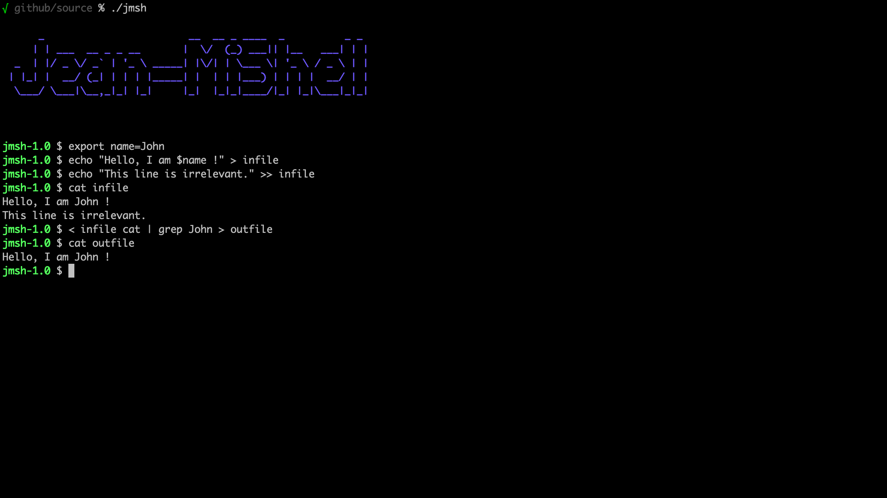

# Minishell
This School-42 project objective is to code a mini shell in C. The shell supports redirections, pipes, setting and unsetting of environment variables, searching the path for command execution, etc.
Completion of this project requires to learn various shell functionalities, the concepts of parent and child processes, piping and file descriptors, parsing and tokenization, signal handling, etc.

